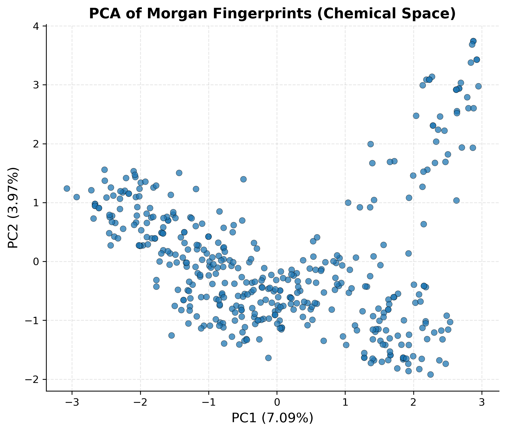
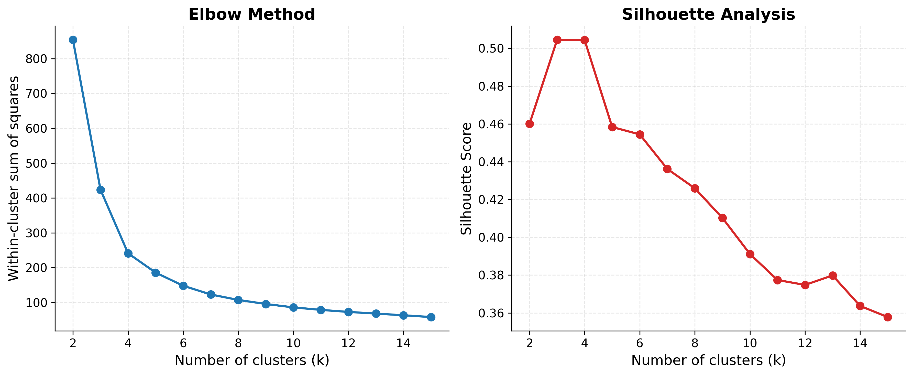

# FabI Natural Product Virtual Screening

Structure-based virtual screening of natural product libraries against 
FabI (enoyl-ACP reductase, PDB: 6AHE) from *Acinetobacter baumannii*, 
a validated antibacterial drug target in fatty acid biosynthesis.

## Pipeline

RDKit drug-likeness filtering → 3D structure generation → PDBQT conversion 
→ AutoDock Vina docking → PCA/KMeans clustering → ligand efficiency ranking 
→ interaction analysis

## Repository structure

- `protein/` — receptor structure (6AHE.pdb) and prepared PDBQT file
- `notebooks/` — RDKit filtering and post-docking analysis notebooks
- `docking/` — Vina docking scores
- `data/` — final selected candidate compounds
- `figures/` — PCA and clustering plots
- `interaction_analysis/` — per-compound binding interaction diagrams
- `docs/` — full workflow and methodology write-up

## Data

Natural product libraries sourced from NPASS, LOTUS, COCONUT, and FooDB; 
~2,519 PDBQT-ready compounds after RDKit filtering (Lipinski RO5 with one 
violation allowed, PAINS, rotatable bonds ≤10 per Veber et al. 2002).

## Docking

AutoDock Vina, grid box center (−37.508, −7.028, −4.076), size 26×26×30 Å, 
exhaustiveness=8. Top 4 representative hits per cluster across 6 clusters, 
24 compounds total, narrowed to 9 final candidates by ligand efficiency.

## Results

**Chemical space (PCA)**

**Cluster selection (KMeans elbow/silhouette)**

## Requirements

See `requirements.txt` — note some tools (AutoDock Vina, OpenBabel, 
MGLTools, PyMOL/Chimera) require separate installation, not pip.

## Methodology

Full workflow details in `docs/workflow_methodology.md`.

